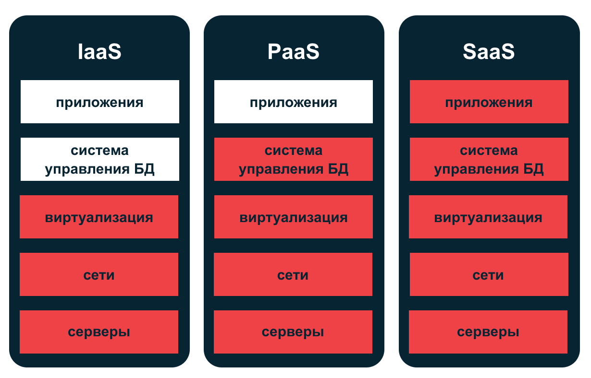
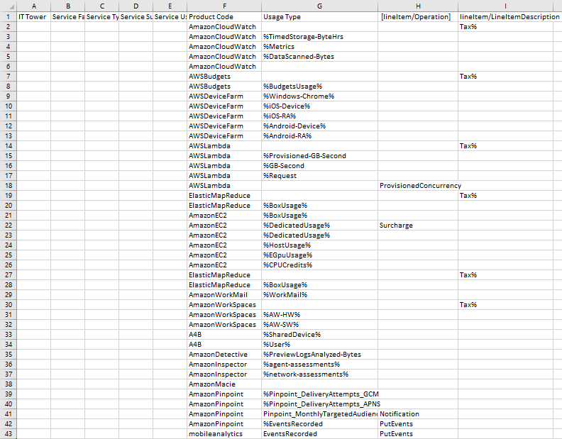
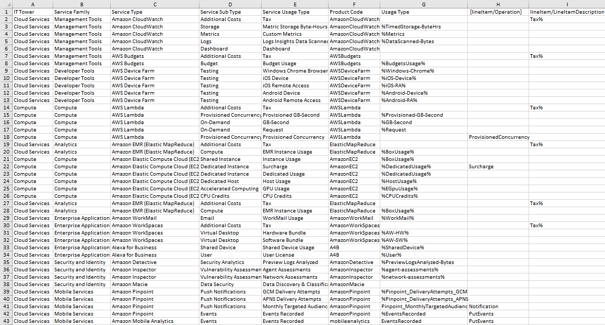

# Лабораторная работа 1. Знакомство с IaaS, PaaS, SaaS сервисами в облаке на примере Amazon Web Services (AWS). Создание сервисной модели.

## Вариант 4

## Цель работы
Знакомство с облачными сервисами. Понимание уровней 
абстракции над инфраструктурой в облаке. Формирование понимания 
типов потребления сервисов в сервисной-модели.

## Позвольте мне маленькую теоретическую справку

#

Можно выделить три основных модели облачных сервисов, каждая 
следующая включает предыдущую.

#### IaaS (Infrastructure as a Service) 
Предлагает пользователям базовые вычислительные ресурсы с 
доступом через всемирную сеть. Они включают в себя серверы, 
хранилище данных, сети, операционные системы. Технология 
позволяет компаниям арендовать инфраструктуру у облачных 
провайдеров, а не инвестировать в собственное оборудование и 
его обслуживание. Этим обусловлена простота, скорость 
развертывания и относительно низкая цена.

#### PaaS (Platform as a Service)
Предоставляет пользователям площадку для разработки, тестирования, 
развертывания и управления приложениями. Эта модель облачных 
услуг включает в себя инфраструктуру, ПО и инструменты для 
разработки и запуска программ. Такой подход освобождает 
разработчиков от необходимости контролировать базовую инфраструктуру.

#### SaaS (Software as a Service)
Предоставляет пользователям готовые приложения, доступные через 
интернет. В модели SaaS клиенты могут использовать ПО без его 
установки, обновления и управления. Все эти операции выполняются 
провайдером, а доступ к приложениям осуществляется через 
веб-браузер. Наиболее простое и доступное решение для тех, кто 
хочет сосредоточиться на своих задачах и делегировать рутинные 
операции профессионалам.

## А теперь к работе

#### Выданная таблица

#### Немного про сервисы
- Amazon CloudWatch - сервис для мониторинга и логирования различных данных в AWS.
- AWS Budgets - сервис для отслеживания и управления бюджетом.
- AWS Device Farm - сервис для тестирования мобильных приложений на различных устройствах.
- AWS Lambda - сервис для запуска кода без управления серверами.
- Elastic MapReduce - сервис для обработки больших данных с помощью фреймворков.
- Amazon EC2 - сервис для запуска виртуальных серверов.
- Amazon WorkMail - сервис для управления корпоративной почтой.
- Amazon WorkSpaces - сервис виртуальных рабочих столов.
- Amazon for Business - сервис для использования устройств и пользователей в бизнес-среде.
- Amazon Detective - сервис для анализа и расследования инцидентов безопасности.
- Amazon Inspector - сервис для автоматической оценки безопасности.
- Amazon Macie - сервис для классификации и защиты данных.
- Amazon Pinpoint - сервис для управления маркетинговыми кампаниями и уведомлениями.
- Amazon Mobile Analytics - сервис для анализа мобильных приложений.

#### Итоговая таблица

## Итого
Создана таблица сервисов AWS, с помощью которой можно 
анализировать назначение и потенциальные затраты этих сервисов.