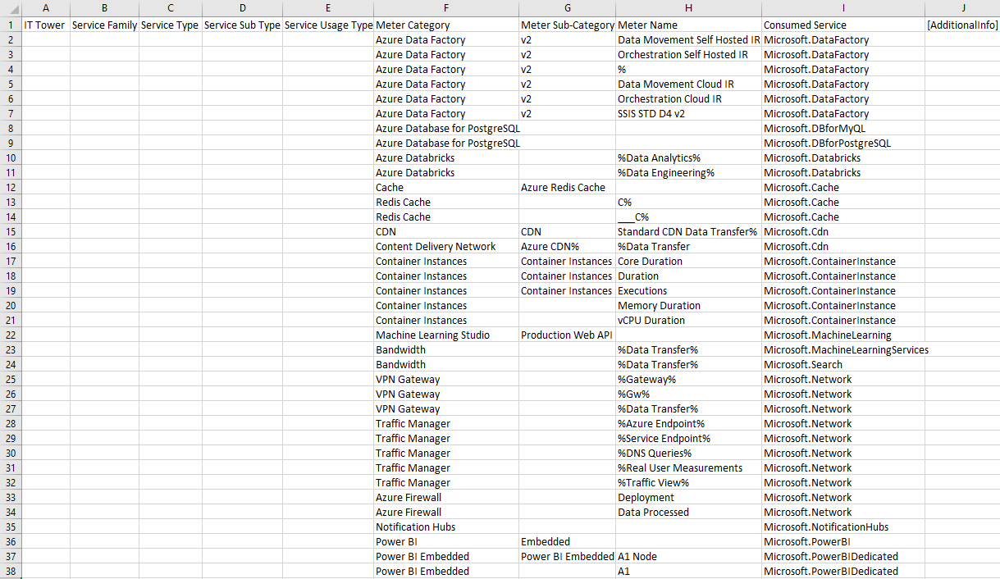
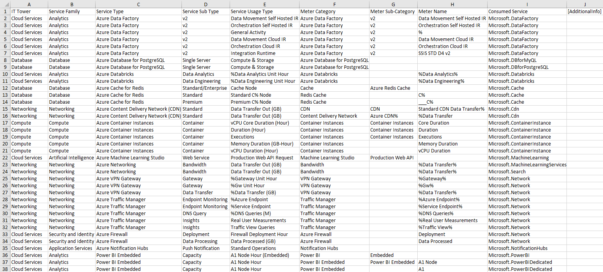

# Лабораторная работа 2. Сравнение сервисов Amazon Web Services и Microsoft Azure. Создание единой кросс-провайдерной сервисной модели.

## Вариант 4

## Цель работы
Получение навыков аналитики и понимания спектра публичных 
облачных сервисов без привязки к вендору. Формирование у 
студентов комплексного видения Облака. В ходе выполнения работы 
не отходить от принципов классификации, выбранных в Лабораторной 
работе 1. 

## Позвольте мне маленькую...

#### Если надо - идем в readme.md в lab_1 и читаем там.

## Выполнение
Для классификации использовалась дока Microsoft Azure:  
<https://learn.microsoft.com/azure/>

#### Выданная таблица

#### Немного про сервисы
- Azure Data Factory - используется для интеграции и оркестрации данных в облаке Azure.
- Azure Databricks - применяется для аналитики и обработки данных.
- Azure Database for PostgreSQL - используется для развертывания и управления базами данных PostgreSQL в облаке Azure.
- Azure Container Instances - сервис для запуска контейнеров, потребление учитывается по CPU, памяти и времени работы.
- Azure Redis Cache - сервис для кэширования данных.
- Azure CDN - сервис для передачи данных через сеть доставки контента.
- VPN Gateway, Traffic Manager, Azure Firewall - сетевые сервисы, связанные с маршрутизацией, безопасностью и передачей данных.
- Machine Learning Studio - сервис для работы с моделями машинного обучения.
- Power BI и Power BI Embedded - SaaS-сервисы для визуализации и анализа данных.
- Notification Hubs - сервис для отправки уведомлений.

#### Итоговая таблица

## Итого
В результате удалось упорядочить сервисы Azure, применив модель, 
основанную на сервисах AWS, тем самым создав классификацию сервисов 
для обоих этих провайдеров. Также получилась таблица, которая 
позволяет отслеживать, на какие именно ресурсы тратятся деньги. 