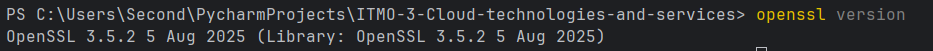
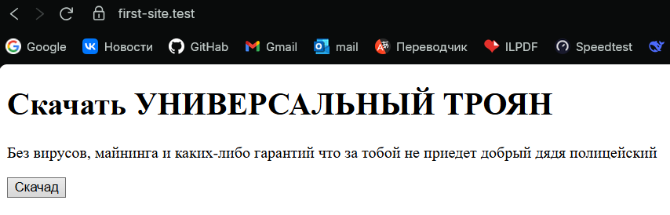
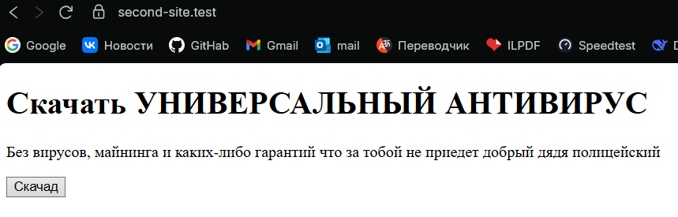

# Лабораторная работа 1.1
# Настройка nginx

Я начал с того, что решил сгенеирровать ssl сертификат и ключ для него. 

## OpenSSL
Я решил использовать для этого OpenSSL - бесплатный инструмент для создания 
самоподписанных ssl сертификатов. Скачал нужный архив с их сайта и добавил 
его в PATH. 


Теперь в отдельной директории создадим файл ssl.conf с конфигом для сертификата. \
Там есть несколько секций:
1) [req] - основные параметры, например, размер ключа
2) [dn] - информация о владельце
3) [v3_req] - параметры использования, например, для чего можно использовать 
ключ и сертификат
4) [alt_names] - добавляем альтернативные домены и ip для которых используется

Теперь создадим приватный ключ
```bash
openssl genrsa -out private.key 4096
```

А теперь и сертификат
```bash
openssl req -new -x509 -key private.key -out certificate.crt -days 365 -config ssl.conf
```

## А что же дальше? 
Правильно, быстро напишем по страничке для 
двух разных "сайтов". \
Лежат они сейчас в nginx-1.28.0/html, но изначально они лежали 
отдельно. 

Попробовал запустить, работает, но ведь только по localhost, а 
надо по доменам. Вроде надо начать писать nginx, но сначала 
идем в файл с локальными доменами и дописываем туда:

```
127.0.0.1 first-site.test
127.0.0.1 second-site.test
```

Теперь при проверке через браузер по этим двум доменам сразу будет 
перенаправление на локальный хост, на котором я и буду запускать nginx.

## Nginx

Тут действуем по уже отработанной ранее схеме - идем на официальный сайт и 
скачиваем архив с нужной нам версией. В моем случае 1.28.0. Его сразу 
перетаскиваем в папку с проектом, так как все относительные пути строятся 
относительно основного файла nginx, лежащего в этой папке. 

## Настройка

Есть основное тело - http{}. \
В нем есть блок server{}, задающий обработку определенных сайтов. \
Вот как выглядит этот блок для дефолтного сервера
```nginx configuration
server {
    listen       80 default_server;
    server_name  localhost;

    location / {
        alias   html/;
        index  index.html index.htm;
    }

    error_page   500 502 503 504  /50x.html;
    location = /50x.html {
        alias   html/;
    }
}
```
Здесь listen определят порт и является ли обработчик дефолтным, server_name - 
имя сервера, location /sth/ {} - обрабатывает страницы, в адресе которых есть 
/sth/. \
root и alias - определяют начало для адреса, но отличие в том, что когда они 
находятся в location, к root также добавляется /sth/ из location, а alias это 
игнорирует. \
index - задаёт файл для использования

## Перенаправление

Просто поставим самым первым блок сервер, который слушает http (порт 80) для 
обоих сайтов и перенаправляет запросы на https
```nginx configuration
server {
    listen 80;
    server_name first-site.test second-site.test;

    # Постоянное перенаправление
    # return 301 https://$host$request_uri;

    # Временное перенаправление
    return 302 https://$host$request_uri;
}
```
return - перенаправляет, 302 - временное, 301 - постоянное, а дальше https с
теми же адресом и параметрами.

Теперь настроим обработку непосредственно для https (порт 443)
```nginx configuration
server {
    listen 443 ssl;
    server_name first-site.test;

    ssl_certificate C:/Users/Second/PycharmProjects/ITMO-3-Cloud-technologies-and-services/lab_1_1/ssl_certs/certificate.crt;
    ssl_certificate_key C:/Users/Second/PycharmProjects/ITMO-3-Cloud-technologies-and-services/lab_1_1/ssl_certs/private.key;

    location / {
        alias html/project_one/;
        index index.html;
    }
}
```
В listen указываем порт 443 и то, что это защищенный ssl. Дальше в 
ssl_certificate и ssl_certificate_key указываем путь до сертификата и ключа. 
Я не очень разобрался, можно ли здесь в относительном пути выходить из 
текущей директории, поэтому указал абсолютный путь.

## Запуск

Запускаем nginx командой
```shell
start nginx
```
Смотрим, что все сайты работают. 
### Первый

### Второй

### Дефолт


Это уже финальный вариант, поэтому все работает, но я, конечно, не сразу к 
нему пришел, а для этого надо было пересобирать nginx. Для этого нужны 2 команды
```shell
nginx -t
nginx -s reload
```
Первая команда проверяет корректность новой конфигурации, а вторая пересобирает, 
если все отлично. 

Юху-у-у! Все работает. Вырубаем командой
```shell
nginx -s quit
```

## Итого...
2:06 ночи, я дописываю отчет. Основную суть по использованию nginx я понял, 
если продолжу изучать, постараюсь разобраться, как с помощью локэйшнов 
нормально организовать переходы, но это уже совсем другая история