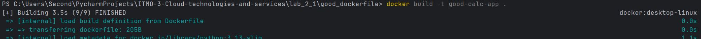
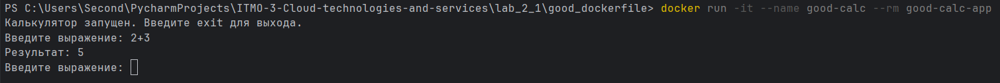
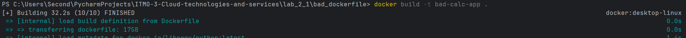
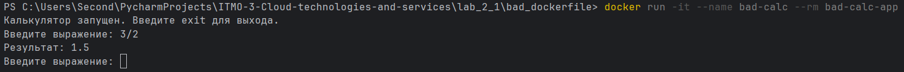

# Лабораторная работа 2.1

Я решил засунуть в контейнер простенькую программу калькулятора на питоне.
Для этого нам в докер файле надо прописать:

1) что в качестве образа мы берем какой-то питон
2) скопировать файл самой программы калькулятора и файл с 
библиотеками, которые надо докачать(в этом случае файл пустой, но всё же)
3) скачать все библиотеки из файла
4) выдать разрешение на исполнение программы
5) запустить саму программу

В качестве примера ошибок я использовал:

1) Использование неконкретной версии. Так, ошибочным я выделил "FROM 
python:latest", так как, во-первых, свежая версия может в некоторых моментах 
менять логику работы, а во-вторых, может иметь какие-то сбои или уязвимости
2) Просто полное копирование, так как в копируемой директории зачастую могут 
лежать доп файлы, нужные в разработке, но лишние в контейнере, например 
".gitignore"
3) Запуск единой команды RUN или COPY для процессов с сильно отличающейся 
частотой обновления, так как при частых изменениях одного процесса придется 
каждый раз переподгружать данные ко второму процессу, который может обновляться 
сильно реже. В моем случае calc.py может являться часто меняющимся процессом, 
в то время как requirements.txt будет менятся очень редко.

## Так, исправления выглядат следующим образом: 

```dockerfile
FROM python:latest 
```
=> 
```dockerfile
FROM python:3.13-slim \
```

что не только даст нам стабильную, но также намного более компактную версию.


## А RUN и COPY 

```dockerfile
COPY . . \
RUN pip install -r requirements.txt && chmod +x calc.py 
```

Заменим на 

```dockerfile
COPY requirements.txt . \
RUN pip install -r requirements.txt \
COPY calc.py . \
RUN chmod +x calc.py \
```

что позволит скопировать только нужные нам файлы, а также обновлять calc.py 
без перезагрузки зависимостей

## Итого, плохая версия:

```dockerfile
FROM python:latest

COPY . . \
RUN pip install -r requirements.txt && chmod +x calc.py

CMD ["python", "calc.py"]
```

## А хорошая:

```dockerfile
FROM python:3.13-slim

COPY requirements.txt . \
RUN pip install -r requirements.txt

COPY calc.py . \
RUN chmod +x calc.py

CMD ["python", "calc.py"]
```

## Проверим, что все работает. 

Сначала для хорошего создадим образ

И запустим контейнер


Теперь для плохого



Сразу заметим, что сборка хорошего заняла 3.5 секунды, а 
плохого 32.2. А проверив, сколько весит каждый образ, 
обнаружим числа 187.92 МБ у хорошего и 1.62 ГБ у плохого. 
Ничего такая разница.


## Плохие практики для контейнеров
Что до плохих практик в работе с контейнерами, то я запомнил 
следующие две:

1) Не использовать контейнер в качестве хранилища данных, так 
как использование контейнеров подразумевает одноразовое 
использование с возможностью замены, а если мы заменим 
контейнер, в котором хранились данные, эти данные безвозвратно 
исчезнут, чего нам, конечно, не хочется
2) Не запускать в одном контейнере более одного основного 
процесса. Основные проблемы: тестирование, обновление и 
отказоустойчивость. Вместо того, чтобы тестировать каждый 
процесс отдельно, придется каждый раз тестировать сразу все 
их вместе. Обновлять придется также сразу все. А если упадет 
один из процессов, он сразу потянет за собой все остальные.

## И...
Резюмируя, можно сказать, что базовые проблемы работы с докером 
я, вроде как, понял.